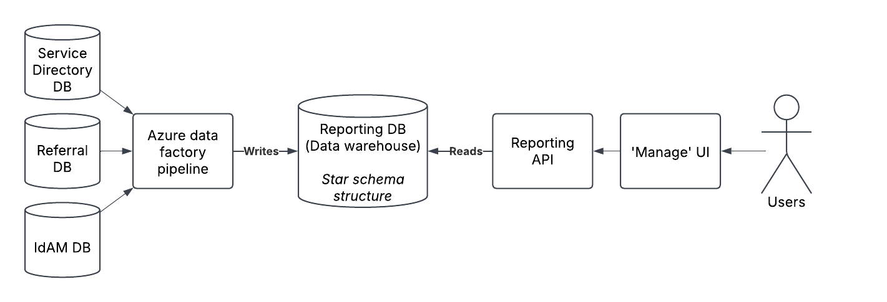

# ADR027 - Build data warehouse for reporting metrics

<!-- 
Editor's note: This is a retroactive ADR made to reflect a decision that had 
               already been made as of writing. 
-->

- **Status**: Accepted
- **Date**: 2025-02-19
- **Author**: Joshua Taylor MBCS

## Decision

We will generate reporting metrics by building a data warehouse, structured with
a star schema. The warehouse will be populated using an Azure data factory (ADF)
pipeline using the existing operational databases as data sources. Access the
data warehouse from the Manage UI through a new 'Reporting API' service.

## Context

In July 2024, the product manager made a feature request to provide end-user metric
and usage reports for the family hubs services for consumption by LA admins,
VCFS admins and DfE admins.

These reports would need to contain, for example:

- the number of organisations recorded
- the number of services stored
- how many searches have been queried

These reports needed be accessible through the 'Manage' service. An
approach for how the reports could be generated and how their underlying data
could be collected needed to be decided.

The approach needed to satisfy the (at the time) high scalability requirements
of the 'Find' and 'Connect' services. Accessing the reports needed to also not
exceed acceptance performance ranges.

## Options considered

1. (SELECTED) Azure data factory ETL pipeline to generate service-fronted data
   warehouse
2. Directly query any service-related metrics <!-- i.e. Do nothing -->

## Consequences

### Option 1 - Azure data factory ETL pipeline to generate service-fronted data warehouse

- Selected because acessing metrics would be very performant.

- Selected because if high user load appears, there would be no degredation of
  performance. It scales well.

- Selected despite it being quite complex to implement. Requires multiple new
  components which bring new maintenance and infrastructure costs.

- Selected despite it being hard to manage Azure data factory (ADF) pipelines
  using terraform, increasing the overhead of creating new environments.

- Selected because the usage of a 'star schema' data warehouse would make any
  new metric requirements easy to provide, provided the right data is loaded.

- Selected despite the difficulty of changing ADF pipelines and their tendendy
  to produce errorsif implemented with steps that rely on the underlying data
  schema, such as stored procedures.

- Selected despite not making use of a key feature of ADF which is its ability
  to graphically create pipelines.

### Option 2 - Directly query any service-related metrics

- Rejected despite its simplicity. No new components would be required, just
  added features to existing components.

- Rejected because of potentially poorer performance. if user load grows, the
  execution time of queries would also grow. Could use caching or replicated
  databases to mitigate this.

- Rejected despite the resulting solution being easier to change and extend.

## Advice

- Aaron Yarborough, Lead developer

    - A separate data warehouse would separate the read load from reporting and
      the write operation from the recording of metrics. Would reduce any
      potential row-locking delays at high volumes.

    - Management of ADF pipelines is possible with IaC, just difficult to do
      with our chosen IaC tool (terraform).

    - With a data warehouse, we'd still need to modify all components in the
      chain to support a new metric.

    - The use of stored procedures in ADF makes it more expensive and
      error-prone to support new reporting requirements. 

- Zac King, Developer

    - ADF is used wrong. We don't use any of its graphical capabilities and the
      use of stored procedures makes it hard to change. It's essentially acting
      like an Azure function.

    - An ETL approach is asynchronous and fast, but that might not be completely
      suitable for this project.

    - The direct query approach would be much more straightforward to develop,
      but potentially less scalable.

    - A read-replica could be used to mitigate performance concerns with the
      direct query approach.

    - Development at some point got paused due to the effort required to add new
      metrics with the ETL approach.

