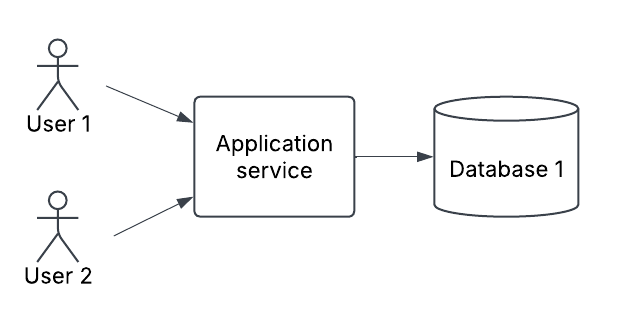
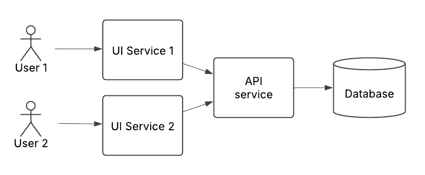
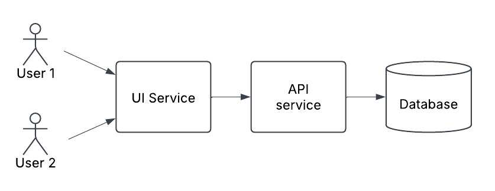

# ADR029 - Merge all API services and databases

- **Status**: Proposed 
- **Date**: 2025-02-25
- **Author**: Joshua Taylor MBCS

## Decision

All existing databases and API components will be merged into a single database
and single API component. Existing UI components, the reporting staging database
and open referral ingestion components will remain as they currently are.

## Context

Since its inception, a microservices architecture style was followed for the
family hubs services. This is defined as distributing the business logic of
family hubs into multiple independently hosted components
([ADR007](./ADR007-use-azure-app-services.md)), each with an exclusive
database([ADR002](./ADR002-use-a-managed-azure-database.md)). These services are
permitted to communicate with each other. Then another layer of independently
hosted UI components would communicate with these services via HTTP
([ADR001](./ADR001-use-http-for-inter-service-comms.md)) as needed to retrieve
data or process business transactions.

According to the previous architect, the main justification for adopting this
architectural style was its scalable and elastic characteristics -- since if the
system came under high user load, each small component could quickly (due to
their size) allocate new resources to deal with the load.

As the family hubs services reached later stages of development and more of the
team turned over, the team found little evidence that large user loads would
appear.

The team also found maintaining the microservices architecture quite arduous,
since any new feature would likely cut across multiple components and require
coordination between components. It also seemed quite wasteful in terms of
resource usage.

Given this revision and the ongoing struggles of the development team, it was
questioned whether the architecture style could be changed to reduce unnecessary
complexity and reduce the costs of changing the service.

## Options considered

1. Single service with host-based routing and a single database
2. (SELECTED) Multiple UI services, one API service and one database
3. Do nothing, retain current microservices structure
4. One UI service with host-based routing, one API service and one database

## Consequences

### Option 1 - Single service with host-based routing and a single database

- Would be the simplest possible architecture from a component stand-point,
  which would:
  - ease the process of making changes
  - improve developer experience, although opinions differ on this in the team
  - ease developer onboarding

- May be overall more reliable, since network faults would not interfere with
  message passing within the system.

- Deployment and environment provisioning pipelines would take less time to run,
  due to fewer components to create and deploy to. 

- Static running costs for infrastructure will be saved, since fewer components
  are running.

- Automated testing suites may need to be optimised, since currently many of
  them run in parallel pipelines.

- Would decrease the scalability of the services, since the entire product 
  would need to scale together. Due to its size, this would take more resources
  compared to separate components at higher loads.

- Removes the ability for partial downtime, which may lead to more overall
  downtime in the system -- for example a database migration could make the
  entire service unavailable instead of in just one user-facing service.

- Removes the ability for component-level fault tolerance.

- Each change to the system would necessarily need a full regression test.

- Responsibilities in the architecture would not be separated into different
  infrastructure, so more team discipline would be required to keep different
  parts of the system separated.

- High implementation effort, considerable work would need to be scheduled to
  transition to this structure.

### Option 2 - (SELECTED) Multiple UI services, one API service and one database 

- Would be simpler than the current architecture which would improve its ability
  to change and improve the developer experience; perhaps comparably to option 1
  although opinions vary.

- Changes to just one UI component would reduce the system-under-test for
  regression testing, since both UI components are isolated, thereby reducing
  test effort. However a change to the domain service would necessarily always
  need a full regression.

- Deployment and environment provisioning pipelines would take less time to run,
  due to fewer components to create and deploy to -- although not to the extent
  of option 1.

- Static running costs for infrastructure will be saved, since fewer components
  are running -- although not to the extent of option 1.

- Would slightly decrease the scalability of the services, since the UI components 
  and domain components could each independently scale but not to the degree of
  option 3.

- Removes the ability for partial downtime, which may lead to more overall
  downtime in the system -- for example a database migration could make the
  entire service unavailable instead of in just one user-facing service.

- Responsibilities in the architecture would not be as separated into different
  infrastructure, so more team discipline would be required to keep different
  parts of the system separated.

- High implementation effort, considerable work would need to be scheduled to
  transition to this structure -- although not to the extent of option 1.

### Option 3 - Do nothing, retaining current microservices architecture

- Would scale better if the service started to experience very high load,
  however there is limited evidence that the service will ever reach these
  loads.

- More fault tolerance is possible to build in, since independently hosted
  components can also fail or error independently.

- Leaves the ability to independently deploy components, reducing the risk
  around deployments. Although in practice, currently all services are deployed
  together.

- Gives a stronger guarantee that domain and UI responsibilities will be
  separated, since they are separated by infrastructure. Less discipline needed
  from the development team required to keep responsibilities separated. 

- Lowest effort option, no work needs to be scheduled.

- Current issues with developer experience and complexity would remain -- likely
  slowing future development and testing efforts. A consequence of microservices
  not being well suited to a single-team structure.

- If transactions or data consistency are required in the future between
  services, this would be harder to facilitate if components are distributed.

- Due to messages being passed over a network, the reliability of these will
  need to always be monitored and retry scenarios considered.

### Option 4 - One UI service with host-based routing, one API service and one database

- Would be simpler than the current architecture which would improve its ability
  to change and improve the developer experience; perhaps comparably to options
  1 and 2 although opinions vary.

- Deployment and environment provisioning pipelines would take less time to run,
  due to fewer components to create and deploy to -- although not to the extent
  of options 1 and 4.

- Static running costs for infrastructure will be saved, since fewer components
  are running -- although not to the extent of option 1.

- Would slightly decrease the scalability of the services, since the UI components 
  and domain components could each independently scale but not to the degree of
  option 3.

- Removes the ability for partial downtime, which may lead to more overall
  downtime in the system -- for example a database migration could make the
  entire service unavailable instead of in just one user-facing service.

- Responsibilities in the architecture would not be as separated into different
  infrastructure, so more team discipline would be required to keep different
  parts of the system separated.

- High implementation effort, considerable work would need to be scheduled to
  transition to this structure -- similar to the extent of option 1.

- Each change to the system would necessarily need a full regression test.

## Advice

- For option 1, I would start to be concerned with scaling. I also don't see a
  huge impact on developer experience between options 1 and 2. As we go down to
  fewer components, we make deployments riskier and the system as a whole less
  fault tolerant. (Aaron Yarborough, Lead developer, 2025-02-27)

- In theory a single service would mean more regression testing, but in practice
  we tend to need to regression test everything for each change. The single
  service would lead to a long running CI pipeline and it would make it harder
  to detect where performance issues are. Keeping the separation of domain/UI
  components would help with performance testing, and may allow for situations
  where we just need to regression test part of the system for a change. (Tina
  Gohil, Test engineer, 2025-02-27)

- Any simplification of the architecture would lead to better [impact
  analysis](https://en.wikipedia.org/wiki/Change_impact_analysis). But the
  benefits of this are negligible since regression testing isn't our bottleneck
  right now. Also with improvements to our automated test approach, the need to
  work out regression testing scope becomes less significant. Component changes
  wouldn't significantly change the automated testing pipeline running time,
  team practices and preferences affect this much more.  (Dami Laleye, Test
  engineer, 2025-02-28)

- Option 2 is my preferred choice, because it still would have a good developer
  experience due to its simplicity and gives us scope to introduce better module
  structures. Unlike option 1, we don't need to take on the risk of host-based
  routing and it allows for a bit of independent scaling. Definitely not option
  3 because it would be very expensive in the long term. I also don't see any
  significant benefits to option 4 over option 1, because we don't have lots of
  UIs and it doesn't seem worth it to merge them and keep a separate UI
  component. (Zac King, Developer, 2025-03-05)

- I think any approach other than option 3 would make the developer experience
  much better. The benefits of independently deploying services isn't taken
  advantage of in the current microservices structure, everything is always
  deployed together. We could also mitigate the availability during migrations
  downside for option 1 by ensuring migrations can be undone if needed and using
  feature flags to release new features rapidly. (Thomas Cheyney, Developer,
  2025-03-03)

- I'm in conflict between 1 and 2. Option 1 is viable because we don't have
  evidence for high user loads so scalability and performance requirements
  matter less. It's also the easiest to maintain. Option 2 gives a bit of
  flexibility and allows for some fault tolerance between UI and API components.
  There's another middle way between (1) and (2) worth considering (Captured as
  option 4). Whatever the option, I think we can save lots of cloud costs and
  save considerable development time by reducing the number of components.
  (Stuart Maskell, Developer 2025-03-04)

- Option 2 has more of an ability to evolve, separate concerns better and would
  be more familiar to the average developer. I would recommend it if we are
  expecting lots of new features to be developed in the future, otherwise I
  would recommend sticking with option 3 -- because it would not be a good
  return on investment in terms of development work. On the whole if
  functionality is split into components instead of internal modules it can help
  the system keep well structured. However fewer components will lead to a
  faster build pipeline and faster environment provisioning. There's not much
  fault tolerance we could introduce into the system, since we have few user
  journeys -- so I don't see it as a key deciding factor. (Paul Armstrong,
  DevOps Engineer, 2025-03-04)
